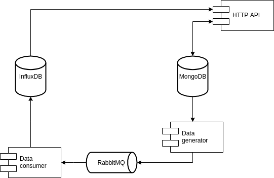
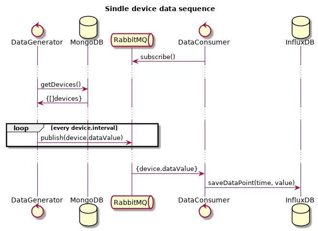

# tsm

This project is meant for learning basics of: Golang, MongoDB, RabbitMQ, InfluxDB

## Problem description

- We need a service that can register devices
- The service cyclically publishes and stores new measurement for each registered device
- Service has to provide REST API that allows:
  - creation of new devices
  - update of device data
  - device removal
  - get device list
  - get device by its id
- Device model consists of: `id`, `name`, `value`, `interval`
- Value stored in the device is value that is published cyclically
- Both Devices and measurements have to be persisted
- Cycle for every device is defined by interval value

### Arch picture

This architecture represents logical description of components. *HTTP API*, *Data consumer* and *Data generator* should be treated as modules within one application.

### Single device data sequence

### Technical requirements

- Result is single Golang service
  - for testing standard golang test library should be used; for assertions [https://github.com/stretchr/testify](https://github.com/stretchr/testify) can be used
  - HTTP server can be bare golang server or server of choice. We are using [https://github.com/gorilla/mux](https://github.com/gorilla/mux).
- MongoDB is used as metadata persistence
- InfluxDB is used as measurements persistence
- RabbitMQ is used as AMQP broker
- Accompanying infrastructure is using Docker
- Whole solution should be startable with one command (for e.g.: docker-compose, Makefile)

